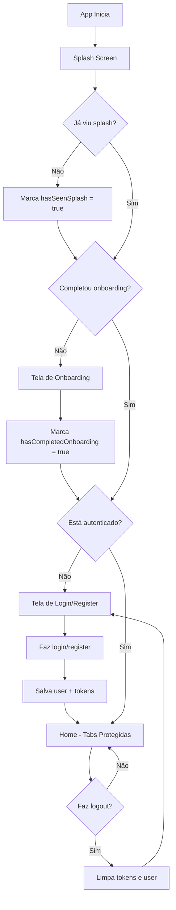

# 🏗️ Arquitetura do App Autonomos

## 📚 Stack Tecnológica

- **Expo SDK 54** com Nova Arquitetura ativada
- **Expo Router v6** para navegação file-based
- **React Native 0.81.5**
- **NativeWind v4** (Tailwind CSS)
- **Zustand** para gerenciamento de estado
- **TypeScript**

---

## 🗂️ Estrutura de Pastas

```
src/
├── app/                          # Rotas (Expo Router)
│   ├── _layout.tsx              # Layout raiz + useProtectedRoute
│   ├── index.tsx                # Splash screen inicial
│   ├── onboarding.tsx           # Tela de onboarding
│   ├── (auth)/                  # 🔓 Grupo de rotas públicas
│   │   ├── _layout.tsx
│   │   ├── login.tsx
│   │   └── register.tsx
│   └── (tabs)/                  # 🔒 Grupo de rotas protegidas
│       ├── _layout.tsx
│       ├── home.tsx
│       ├── search.tsx
│       ├── bookings.tsx
│       └── profile.tsx
├── features/                     # Features organizadas
│   ├── auth/
│   ├── home/
│   ├── onboarding/
│   └── splash/
├── stores/                       # Zustand stores
│   ├── authStore.ts             # Estado de autenticação
│   ├── appStore.ts              # Preferências e flags
│   └── index.ts
├── hooks/                        # Hooks customizados
│   └── useProtectedRoute.ts     # Proteção e redirecionamento
├── types/                        # TypeScript types
│   └── navigation.ts
└── components/                   # Componentes compartilhados
```

---

## 🔐 Sistema de Autenticação e Proteção de Rotas

### Como Funciona

1. **Splash Screen** (`index.tsx`)
   - Sempre mostra ao carregar o app
   - Marca `hasSeenSplash = true` após exibição
   - Aguarda redirecionamento do `useProtectedRoute`

2. **Onboarding** (`onboarding.tsx`)
   - Exibido apenas se `hasCompletedOnboarding = false`
   - Marca `hasCompletedOnboarding = true` ao finalizar
   - Pode ser pulado

3. **Fluxo de Redirecionamento** (`useProtectedRoute`)

```typescript
// Lógica de redirecionamento automático:

1. !hasSeenSplash → redireciona para "/"
2. hasSeenSplash && !hasCompletedOnboarding → redireciona para "/onboarding"
3. !isAuthenticated && tentando acessar (tabs) → redireciona para "/(auth)/login"
4. isAuthenticated && tentando acessar (auth) → redireciona para "/(tabs)/home"
5. isAuthenticated && completou onboarding → redireciona para "/(tabs)/home"
```

### Grupos de Rotas

**`(auth)/`** - Rotas públicas (não requer autenticação)
- `/login`
- `/register`

**`(tabs)/`** - Rotas protegidas (requer autenticação)
- `/home`
- `/search`
- `/bookings`
- `/profile`

---

## 💾 Gerenciamento de Estado - Zustand

### 🔒 authStore - Autenticação e Usuário

```typescript
import { useAuthStore } from '@/stores';

const { 
  user,                    // Dados do usuário
  isAuthenticated,         // Status de autenticação
  isLoading,              // Loading state
  signIn,                 // Função de login
  signUp,                 // Função de registro
  signOut,                // Função de logout
  updateUser              // Atualizar dados do usuário
} = useAuthStore();
```

**Persistência:**
- ✅ Dados do usuário → AsyncStorage
- 🔒 Tokens (access/refresh) → SecureStore (criptografado)

---

### ⚙️ appStore - Preferências e Flags

```typescript
import { useAppStore } from '@/stores';

const {
  hasSeenSplash,                    // Já viu splash?
  hasCompletedOnboarding,           // Completou onboarding?
  theme,                            // 'light' | 'dark' | 'system'
  language,                         // 'pt' | 'en'
  notificationsEnabled,             // Notificações ativas?
  setHasSeenSplash,
  setHasCompletedOnboarding,
  setTheme,
  resetApp                          // Reset completo
} = useAppStore();
```

**Persistência:**
- ✅ Tudo vai para AsyncStorage (não sensível)

---

## 🧠 Quando Usar Qual Storage?

| Cenário | Storage | Motivo |
|---------|---------|--------|
| Tokens, credenciais, dados sensíveis | **SecureStore** | Criptografado nativamente |
| Tema, preferências, flags internas | **AsyncStorage** | Leve, rápido, não sensível |
| Cache offline de listas | **AsyncStorage** | Grande volume de dados |

---

## 🚀 Exemplos de Uso

### Fazer Login

```typescript
import { useAuthStore } from '@/stores';

function LoginScreen() {
  const { signIn, isLoading } = useAuthStore();

  const handleLogin = async () => {
    try {
      await signIn('email@exemplo.com', 'senha123');
      // Redirecionamento automático para /(tabs)/home
    } catch (error) {
      Alert.alert('Erro', 'Login falhou');
    }
  };

  return (
    <TouchableOpacity onPress={handleLogin} disabled={isLoading}>
      <Text>{isLoading ? 'Entrando...' : 'Entrar'}</Text>
    </TouchableOpacity>
  );
}
```

### Fazer Logout

```typescript
import { useAuthStore } from '@/stores';

function ProfileScreen() {
  const { signOut, user } = useAuthStore();

  return (
    <>
      <Text>{user?.name}</Text>
      <TouchableOpacity onPress={signOut}>
        <Text>Sair</Text>
      </TouchableOpacity>
    </>
  );
}
```

### Acessar Dados do Usuário

```typescript
import { useAuthStore } from '@/stores';

function HomeScreen() {
  const { user, isAuthenticated } = useAuthStore();

  if (!isAuthenticated || !user) return <LoginPrompt />;

  return (
    <View>
      <Text>Olá, {user.name}!</Text>
      <Text>Tipo: {user.role === 'client' ? 'Cliente' : 'Profissional'}</Text>
    </View>
  );
}
```

### Mudar Preferências

```typescript
import { useAppStore } from '@/stores';

function SettingsScreen() {
  const { theme, setTheme } = useAppStore();

  return (
    <TouchableOpacity onPress={() => setTheme('dark')}>
      <Text>Tema atual: {theme}</Text>
    </TouchableOpacity>
  );
}
```

---

## 🎯 Próximos Passos

Agora que a arquitetura está pronta, você pode:

1. ✅ **Adicionar novas telas protegidas** em `(tabs)/`
2. ✅ **Adicionar novas telas públicas** em `(auth)/`
3. ✅ **Integrar com API real** (substituir mocks em `authStore.ts`)
4. ✅ **Adicionar refresh token logic**
5. ✅ **Implementar recuperação de senha**
6. ✅ **Adicionar validação de formulários**
7. ✅ **Implementar cache de dados** usando AsyncStorage

---

## 🔄 Fluxo Completo do Usuário



---

## ⚠️ Importante

- ⚡ **Não modifique `useProtectedRoute`** sem entender completamente o fluxo
- 🔒 **Sempre use SecureStore para tokens** - nunca AsyncStorage
- 🧪 **Lembre-se que `signIn/signUp` são mocks** - integre com API real
- 📱 **Teste o fluxo completo** após qualquer mudança em auth/routing

---

## 🐛 Debugging

Para resetar o app durante desenvolvimento:

```typescript
import { useAppStore, useAuthStore } from '@/stores';

// Reset completo
useAppStore.getState().resetApp();
useAuthStore.getState().signOut();

// Ou limpe AsyncStorage manualmente
import AsyncStorage from '@react-native-async-storage/async-storage';
await AsyncStorage.clear();
```

Para limpar SecureStore:

```typescript
import * as SecureStore from 'expo-secure-store';

await SecureStore.deleteItemAsync('access_token');
await SecureStore.deleteItemAsync('refresh_token');
```

